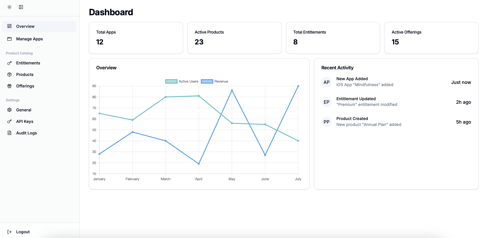

Join our Discord community:  
<a href="https://discord.gg/TfXNmjN54b"></a> 

# Wildberry Admin Dashboard

A modern, feature-rich admin dashboard built with Next.js 13, TypeScript, and Tailwind CSS.



## Features

### 🎯 Core Features

- **Authentication System**
  - Secure login with environment variable-based credentials
  - Protected routes and sessions

- **Modern UI Components**
  - Responsive sidebar with collapsible navigation
  - Dark/Light mode support
  - Modern and clean interface
  - Built with shadcn/ui components

### 📊 Dashboard Sections

#### 1. Overview
- Main dashboard with key metrics
- Recent activity feed
- Quick access to important features

#### 2. Apps Management
- List and manage applications
- Application status monitoring
- Detailed app analytics

#### 3. Product Catalog
- **Products**
  - Product listing and management
  - Product details and configuration
  
- **Entitlements**
  - Manage user entitlements
  - Access control settings
  
- **Offerings**
  - Configure product offerings
  - Pricing and feature management

#### 4. Settings
- **General Settings**
  - System configuration
  - Project preferences
  
- **API Keys**
  - Generate and manage API keys
  - Access token configuration
  
- **Audit Logs**
  - Track system activities
  - User action history

## 🚀 Getting Started

### Prerequisites
- Node.js 16.x or later
- npm or yarn package manager

### Installation

1. Clone the repository:
   ```bash
   git clone <repository-url>
   cd wildberry/front-end
   ```

2. Install dependencies:
   ```bash
   npm install
   # or
   yarn install
   ```

3. Set up environment variables:
   Create a `.env` file in the root directory:
   ```env
   NEXTAUTH_SECRET=your-secret-key
   ADMIN_USERNAME=your-admin-username
   ADMIN_PASSWORD=your-admin-password
   ```

4. Run the development server:
   ```bash
   npm run dev
   # or
   yarn dev
   ```

5. Open [http://localhost:3000](http://localhost:3000) in your browser

## 🌐 Deployment

### Vercel Deployment
1. Push your code to a Git repository
2. Import your project to Vercel
3. Configure environment variables
4. Deploy!

### Docker Deployment
1. Build the Docker image:
   ```bash
   docker build -t wildberry-admin .
   ```

2. Run the container:
   ```bash
   docker run -p 3000:3000 wildberry-admin
   ```

## 🛠 Technology Stack

- **Framework**: Next.js 13 (App Router)
- **Language**: TypeScript
- **Styling**: Tailwind CSS
- **UI Components**: shadcn/ui
- **State Management**: React Hooks
- **Authentication**: Environment Variables (Customizable)

## 📁 Project Structure

```
src/
├── app/                    # Next.js 13 app directory
│   ├── (auth)/            # Authentication routes
│   ├── dashboard/         # Dashboard pages
│   └── layout.tsx         # Root layout
├── components/            # Reusable components
│   ├── layout/           # Layout components
│   └── ui/               # UI components
├── styles/               # Global styles
└── lib/                  # Utility functions
```

## 🔒 Security

- Secure authentication system
- Protected API routes
- Environment variable management
- No hardcoded credentials

## 🤝 Contributing

1. Fork the repository
2. Create a new branch
3. Make your changes
4. Submit a pull request

## 📝 License

This project is licensed under the MIT License - see the [LICENSE](LICENSE) file for details.

## 🆘 Support

For support, please open an issue in the repository or contact the maintainers.
